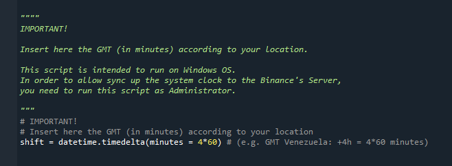

## Description
A tool for Binance Futures USD-M trading. It includes a top ranking of cryptocurrencies sorted by Rise, Fall, High/Low RSI and Volatility, all of them in real-time. This tool also provide an enhanced trailing stop-loss mechanism. Finally, the user can view the total session gain on screen as well as the account balance.

## Author
**Abraham Hidalgo**
* [LinkedIn](https://www.linkedin.com/in/hidalgoabraham/)

## Screenshots


<br />
Main window.
<br />
<br />
<br />
 


<br />
Ranking's window.
<br />
<br />
<br />


## How to install:
You can download this repository an run the Principal_HTT.py file. You'll need to previously install the following packages (e.g. via pip):

```
pip install pywin32
```
```
pip install python-binance
```
```
pip install unicorn-binance-websocket-api
```
```
pip install unicorn-fy
```
```
pip install ta
```
```
pip install PyQt5
```
```
pip install TA-Lib
```

<br />

If you have issues installing TA-Lib via pip, please refer to the library's [main repository](https://blog.quantinsti.com/install-ta-lib-python/).  Also, [this post](https://github.com/mrjbq7/ta-lib) could help.

This app is intended to run on Windows OS, but you can modify it according to your OS. In order to allow sync up the system clock to the Binance's Server, you'll need to run this script as Administrator. It's important to set the GMT according to your location:

<br />




## Contact me
If you have any questions or want to hire me, please write an email to ahidalgo3@uc.edu.ve or aj.hidalgo2310@gmail.com.

## License

[MIT](https://choosealicense.com/licenses/mit/) Public License.


